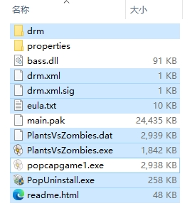

## Counter-Strike Online Singapore 2011

[百度网盘](https://pan.baidu.com/s/15nVAumsSyG8QaZvndR6gSg?pwd=csol)提取码:`csol`

[MediaFire](https://www.mediafire.com/folder/ec6efoohz16i7/Counter-Strike_Online_Singapore_2011)

[123云盘](https://www.123pan.com/s/9s7uVv-461iH)

## item(用于修改商店物品)

[item.csv](file/item.csv)

* * *

## Minecraft 各版本资源

[天翼云盘](https://cloud.189.cn/web/share?code=3qAVz2jaqMbm)（访问码：`up13`）

[百度网盘](https://pan.baidu.com/s/1yHusCq6R3YJCLCaMUY6JKQ?pwd=9e59)提取码:`9e59`

[123云盘](https://www.123pan.com/s/9s7uVv-9SxiH.html)

* * *

## Plants vs. Zombies 各版本资源

[百度网盘](https://pan.baidu.com/s/1ZyJd_tiPX4uoyUZ1UZ8FrA?pwd=pvsz)提取码:`pvsz`

[123云盘](https://www.123pan.com/s/9s7uVv-Py1iH)

请注意: Windows系统版本除了中文都未购买，仅提供试玩, 需要~购买密钥激活~（除了Steam的数字版，已无购买渠道）或者手动破解版权限制.

已试玩时间记录在注册表`TimesPlayed`和文件`popcinfot.dat`中, 累计最多 60 分钟.

### Windows 试玩60分钟限制破解 方法来自[植僵工具箱](https://pvz.tools/)

安装后进入 Plants vs. Zombies 文件夹进行操作. 其中 PlantsVsZombies.exe 是启动器, PlantsVsZombies.dat 是被加密的游戏本体, 运行启动器后会在存档文件夹的位置解密出游戏主程序本体 popcapgame1.exe.

试玩时在游戏运行的状态下把本体复制出来, 放到启动器同样的位置下, 即可完成破解.

如果存在 PlantsVsZombies.exe 和 popcapgame1.exe 两个进程, 结束前者就能复制本体文件了.

脱壳之后启动器和加密文件可以删除, 再把本体重命名为 PlantsVsZombies.exe ,可以删除的文件(夹): drm/ drm.xml drm.xml.sig PopUninstall.exe eula.txt readme.html.

### 独显无法打开“3D加速”解决方法

下载[WineD3D](/file/wined3d_1.7.52.zip)，把解压出的文件放入安装文件夹，重新打开游戏即可

* * *

## Counter-Strike Global Offensive 1.0.0.60 (Mar 15 2012)

[百度网盘](https://pan.baidu.com/s/1RQaBGQBRkQ84nM-4xpywHw?pwd=72pt)提取码:`72pt`

[123云盘](https://www.123pan.com/s/9s7uVv-JQ4iH)

* * *

## Counter-Strike Online 2

[百度网盘](https://pan.baidu.com/s/1nmb05e9CG3ePDyA53f3YFA?pwd=cso2)提取码:`cso2`

[123云盘](https://www.123pan.com/s/9s7uVv-lj1iH)

[资源来源](file/zyly.txt)

* * *

[Counter-Strike ZBOT及中文无线电文字整合包](file/cstrike_radio_bots.zip)

* * *

[《半衰期：起源》隐藏式字幕补丁（简体、繁体中文）](/file/half-life_source_chinese_closecaption.zip)

* * *

## 《半衰期: 起源》修复版 简体中文汉化

[百度网盘](https://pan.baidu.com/s/12hojxAxvX8kedCThp5ldHA?pwd=9gdd)提取码:`9gdd`

[123云盘](https://www.123pan.com/s/9s7uVv-fbfiH.html)

[天翼云盘](https://cloud.189.cn/web/share?code=2Y73qeBjmM3i)访问码：`rti3`

* * *

## 《半衰期》零售版（Won版）简体中文汉化

[百度网盘](https://pan.baidu.com/s/1JNIYFL75yaFmxY4oG4pzWw?pwd=hlwc)提取码:`hlwc`

[123云盘](https://www.123pan.com/s/9s7uVv-w5xiH.html)

* * *

[Synergy模组汉化补丁](/file/synergy_schinese.zip)

* * *

## Counter-Strike Global Offensive 1.34.0.0

[百度网盘](https://pan.baidu.com/s/12AdIEi441ERR2X3nsDubqA?pwd=u3n1)提取码:`u3n1`

[123云盘](https://www.123pan.com/s/9s7uVv-hfpiH.html)

* * *

## Need For Speed Most Wanted 原版简繁中、英文CD镜像及宽屏补丁

[百度网盘](https://pan.baidu.com/s/1VjSyNazANaA16pPXZc-wMA?pwd=nsmw)提取码:`nsmw`

[123云盘](https://www.123pan.com/s/9s7uVv-dqpiH.html)

* * *

## Need For Speed Most Wanted PSP版 安卓移植

[百度网盘](https://pan.baidu.com/s/10o79v6KsI8wrbCdDxCgyMw?pwd=nsmw)提取码:`nsmw`

[123云盘](https://www.123pan.com/s/9s7uVv-vVpiH.html)

* * *

## REDASH Soundtrack

#### THE RED HOOD

loading the player...

#### OUR HOMETOWN

loading the player...

#### Dear. SnowWhite

loading the player...

#### all Downhill

loading the player...
 

#### MOG(Memory of Goddess Mini Game)

loading the player...

#### Ashsmoke

loading the player...

#### Daybreak

loading the player...

#### Thanks to Goddess

loading the player...

#### Freesia

loading the player...

#### Hold you tight

loading the player...

* * *

## Tom Clancy's Rainbow Six Siege v1.05

已整合PLAZA团队制作的离线补丁

[123云盘](https://www.123pan.com/s/9s7uVv-qofiH.html)

[天翼云盘](https://cloud.189.cn/web/share?code=JjMBFbfiqMNz)访问码:`bu5t`

* * *

[《反恐精英》25周年版本简体中文修复及Z-BOT整合包](/file/cstrike_25th_update_fix_for_schinese.zip)

* * *

## 《反恐精英》精简版

基于[叶风CS1.6精简版](https://www.lanzv.com/iLonM1ooz4xc)制作

[百度网盘](https://pan.baidu.com/s/13g63UAqO3bjiRTAwtDs6Ig?pwd=aid5)提取码: `aid5`

[天翼云盘](https://cloud.189.cn/web/share?code=yQvEva7RRrIv)（访问码：`lao8`）

[蓝奏云](https://www.lanzv.com/b023u6vgj )密码:`3ztz`

[123云盘](https://www.123pan.com/s/9s7uVv-OjfiH.html)

我第一次玩CS就是这个版本，从老电脑中翻出来后就有了想复原成原版的想法，2022年制作的第一版可以在[Counter-Strike精简版 发行版 - Gitee.com](https://gitee.com/pzwboy/counter-strike-lite/releases)中下载

* * *

[《我的世界》Java版 中国版“终末之诗”资源包补丁](/file/end_schinese.zip)

